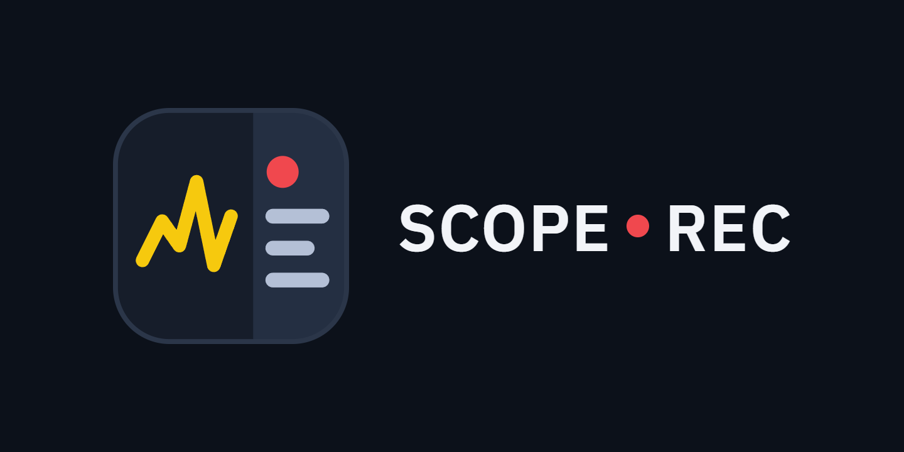

<p align="center"></p>

# ScopeRec

Osiloskoptan USB ya da ağ üzerinden sürekli ölçüm okuyan Windows uygulaması.
Osiloskopla WinUSB sürücüsü üzerinden doğrudan konuşur; NI-VISA ya da USBTMC sürücüsü gerekmez.

## Desteklenen cihazlar

| Marka | Durum |
|---|---|
| Siglent (SDS1104X-E) | Gerçek cihazla denendi |
| Rigol, Keysight / Agilent, Tektronix | Komut setleri kılavuzlara göre yazıldı, **gerçek cihazla denenmedi** |
| Diğer markalar | Keysight tarzı genel SCPI komutları denenir |

Komut seti cihaz kimliğinden (`*IDN?`) otomatik seçilir; soldaki **Komut seti** listesinden elle de seçilebilir.
Bağlantı USB (WinUSB sürücüsüyle, USB Test & Measurement sınıfındaki ilk cihaz) ya da ağ (ham SCPI soketi, `IP:port`) olabilir.
Yeni bir marka eklemek için `cihaz.cs` içindeki `Dialect` sınıfına bir komut şablonu eklemek yeterlidir.

## Kullanım

`ScopeRec.exe` dosyasını çalıştırın, soldan kanal ve parametreleri seçip **Başlat**'a basın.

- **Başlat / Duraklat / Devam et / Testi bitir**: duraklatınca test açık kalır; devam edince grafik, süre ve kayıt dosyaları kaldığı yerden sürer (aradaki boşluk grafikte kesik görünür). **Testi bitir** onay sorar, dosyaları kapatır; sonraki başlatma sıfırdan yeni testtir
- Kanal (C1–C4) ve ölçüm seçimi: RMS, ortalama (DC), tepe-tepe, frekans, periyot vb.
- Canlı değer kutuları (min / maks / ortalama) ve canlı grafik (30 sn – 3 gün arası zaman aralığı; veri pencereden uzunsa alttaki çubukla geçmişte gezilir)
- Limit kontrolü: değer alt/üst limitin dışına çıkınca uyarır, olayı saatiyle ve süresiyle kaydeder
- CSV kaydı (varsayılan `kayitlar` klasörüne; **Kayıt yeri…** ile konum ve klasör adı test başlamadan seçilebilir)
- Osiloskop ekran görüntüsü alma (yalnızca Siglent)
- Türkçe / İngilizce arayüz ve açık / koyu tema (üst çubuktaki listelerden)
- Grafiği temizleme (onay sorar; CSV kayıtlarına dokunmaz) ve tüm ayarları varsayılana döndürme
- Grafikte fare tekerleğiyle zamanda, Ctrl+tekerlekle değer ekseninde yakınlaştırma; çift tık sıfırlar. Fare altındaki anın değeri imlecin yanında görünür

## Seri port (gömülü terminal)

ScopeRec'in sağındaki **Seri port** paneli ayrı bir terminal programına gerek bırakmaz: Arduino, STM32, ESP32, CH340 gibi
COM portundan veri gönderen cihazları ölçümle aynı pencerede izlersiniz.

- Aynı anda 3 seri bağlantıya kadar: panelin üstündeki 1 / 2 / 3 sekmelerinin her biri ayrı bir port, ayrı terminal ve ayrı kayıt dosyasıdır (`_seri.txt`, `_seri2.txt`, `_seri3.txt`); 2. ve 3. bağlantının değerleri `T#2`, `T#3` gibi adlandırılır
- Port ve baud hızı seçip **Bağlan**; gelen satırlar zaman damgasıyla listelenir, alttaki kutudan komut gönderilir (satır sonu seçilebilir)
- Satırlardaki sayılar kendiliğinden ayıklanır: `SET:1500,ACT:1498,T:+45.3` → SET, ACT, T; `ad=değer` ve yalnızca sayılardan oluşan satırlar (S1, S2…) da tanınır
- **Gelen değerler** listesinde işaretlenenler, osiloskop ölçümüyle aynı grafikte sağ eksende çizilir (aynı zaman ekseni)
- Kayıt: ölçüm kaydı açıkken satırlar `<ölçüm adı>_seri.txt` dosyasına, ölçüm yokken `seri_<port>_<tarih>.txt` dosyasına yazılır (saat, t, satır; sekmeyle ayrık)
- DTR / RTS varsayılan olarak kapalıdır; böylece çalışan bir Arduino'ya bağlanınca kart yeniden başlamaz
- Port kutusuna `tcp://adres:port` yazılarak ağ üzerinden seri köprülere de bağlanılabilir
- Üst çubuktaki **Seri port** düğmesi paneli gizler / gösterir; port, hız ve grafikte gösterilen değerler hatırlanır

ScopeView, ölçüm dosyasının yanındaki `…_seri.txt` kaydını kendiliğinden açar ve seri değerleri ölçümle aynı grafikte gösterir;
yalnızca seri kayıt dosyası bırakılırsa onu tek başına açar.

## Kayıt görüntüleyici (ScopeView)

`ScopeView.exe` önceden alınmış kayıtları inceler. Ölçüm dosyasını (`olcum_….csv`) ve log dosyasını (`…_log.txt` ya da `…_olaylar.csv`)
pencereye sürükleyip bırakın; yalnızca ölçüm dosyası bırakılırsa yanındaki log kendiliğinden açılır.

- Tüm kaydın grafiği; fare tekerleğiyle zamanda, Ctrl+tekerlekle değer ekseninde yakınlaştırma, sürükleyerek aralık seçme, alttaki çubukla gezme
- Olay listesi: limit dışı aralıklar, iletişim hataları, bağlantı kopmaları, veri kesintileri; olaya tıklayınca grafik oraya gider
- Limit dışı aralıklar grafikte kırmızı şeritle gösterilir
- Limit analizi: logu olmayan eski kayıtlarda da alt/üst limit girip limit dışı aralıkları bulur
- Zaman ekseni kaydın kendi süresini gösterir (00:00:00 kaydın başı); üstteki listeden gerçek saate çevrilebilir
- Fare altındaki anın kayıt süresi, saati ve değerleri durum çubuğunda

ScopeRec kayıt sırasında `…_log.txt` dosyasını da yazar (zaman, t, mesaj; sekmeyle ayrık).

## Gereksinimler

- Windows, .NET Framework 4 (Windows ile birlikte gelir)
- Osiloskop için WinUSB sürücüsü (Zadig ile kurulabilir)

## Komut satırı aracı

`sds.exe` aynı bağlantıyı komut satırından kullanır:

```
sds.exe                         etkileşimli SCPI terminali
sds.exe "*IDN?"                 tek sorgu
sds.exe --meas C1:RMS,PKPK      ölçümleri sürekli oku (--csv dosya ile kaydet)
sds.exe --wave C1               dalga şeklini sürekli çek
sds.exe --tcp 5025              TCP köprüsü
```

`olcum-baslat.bat` ve `terminal.bat` bu aracı çift tıklamayla başlatır.

## Derleme

`derle.bat` iki programı Windows ile gelen C# derleyicisiyle derler; başka bir kurulum gerekmez.

| Dosya | İçerik |
|---|---|
| `usb.cs` | WinUSB üzerinden USBTMC çerçevelemesi (ortak) |
| `cihaz.cs` | Bağlantı arayüzü, ağ bağlantısı ve marka bazlı komut setleri |
| `ortak.cs` | Dil, tema ve sayı biçimlendirme (iki uygulama için ortak) |
| `seri.cs` | Seri port bağlantısı, port listesi, satırlardan değer ayıklama |
| `gui.cs` | ScopeRec: ölçüm uygulaması |
| `seri_gui.cs` | ScopeRec'in seri port paneli |
| `kayit.cs` | ScopeView: kayıt görüntüleyici |
| `sds.cs` | Komut satırı aracı |

## Not

Sorgular arasında en az 40 ms beklenir: SDS1104X-E, sorgular arka arkaya gelirse yeni yakalama yapamıyor
(ekran donuyor ve hep aynı değer dönüyor).
